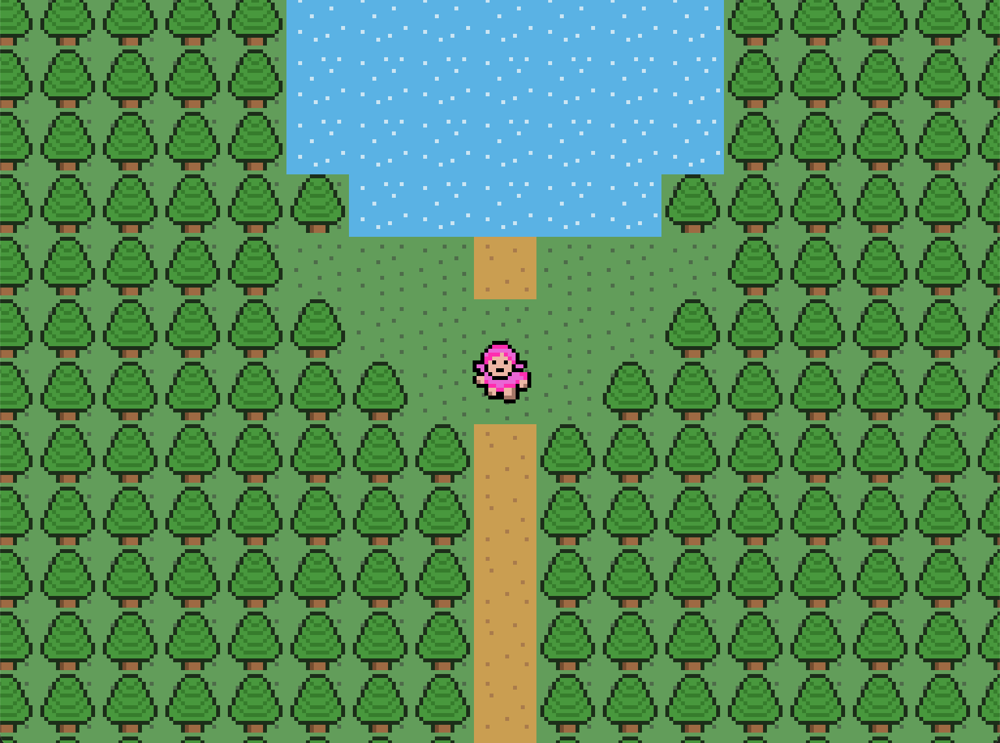

# 2D_Explorer_Game
Simple explorer game created with Java

## Technologies
Project is created with:
* Java Version 11

## Setup
To run this project, install it locally and open it in an IDE such as VSCode.
Open src/main/Main.java and run it using your IDE.
Use the keys w, a, s, d to move.

## Project Status
In development:
- Player can move around a world map

## Source
This project is based on the tutorials by RyiSnow.
* https://www.youtube.com/playlist?list=PL_QPQmz5C6WUF-pOQDsbsKbaBZqXj4qSq

The structure/design of the project has also been inspired by the COMP2511 Project and uses their util files.

